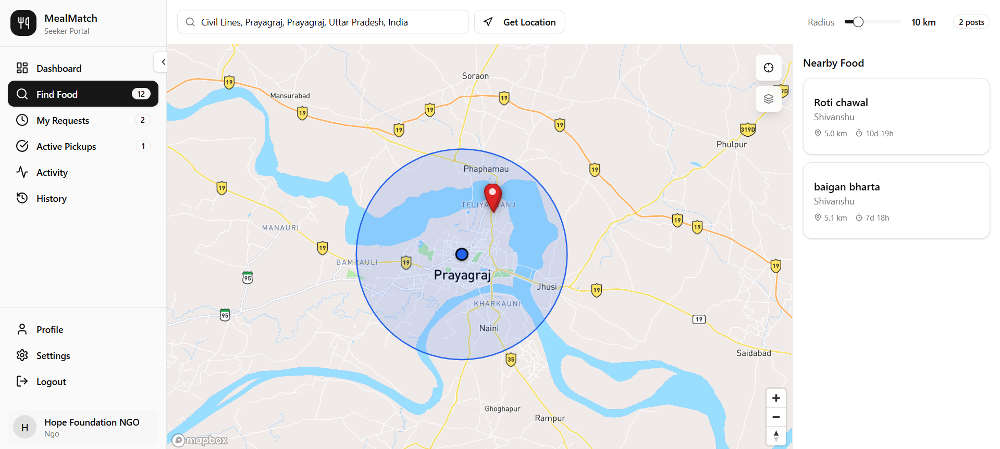
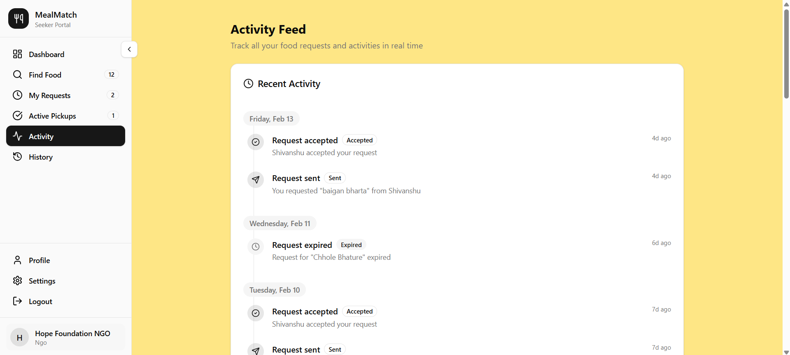
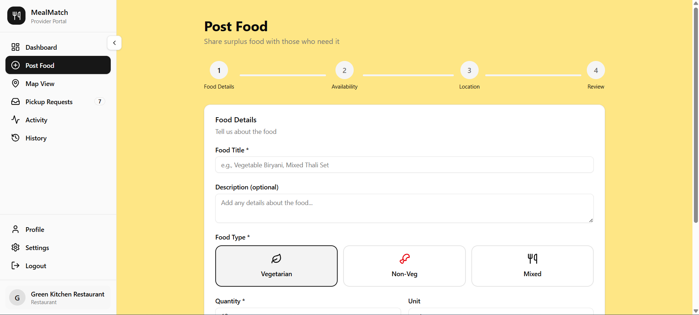

<a id="readme-top"></a>

<div align="center">

[](https://github.com/Shivanshu0915/MealMatch/graphs/contributors)&nbsp;[](https://github.com/Shivanshu0915/MealMatch/network/members)&nbsp;[](https://github.com/Shivanshu0915/MealMatch/stargazers)&nbsp;[](https://github.com/Shivanshu0915/MealMatch/issues)&nbsp;[](https://github.com/Shivanshu0915/MealMatch/blob/main/LICENSE.txt)&nbsp;[](https://www.linkedin.com/in/shivanshu-pathak-11449b283/)

</div>
<br />
<div align="center">
  <a href="https://github.com/Shivanshu0915/MealMatch">
    
  </a>

<h3 align="center">MealMatch © 2025</h3>
  <p align="center">
    A real-time, location-based food sharing platform that connects surplus food providers with nearby seekers to reduce food wastage.
    <br />
    <br />
     <a href="https://mealmatch-frontend-iiw5.onrender.com/">
      
    </a>
    <a href="https://youtu.be/PPlCbUlSRHE">
      
    </a>
    <br />
    <br />
    <strong>Demo Credentials</strong><br/>
    User → elysm1961@gmail.com | shivanshu <br/>
    Admin → elysm1961@gmail.com | shivanshu
    <br />
    <br />
    <a href="https://github.com/Shivanshu0915/MealMatch/issues">Report Bug</a>
    * 
    <a href="https://github.com/Shivanshu0915/MealMatch/issues">Request Feature</a>
  </p>
</div>

<details class="toc">
  <summary>Table of Contents</summary>
  <ol>
    <li>
      <a href="#about-the-project">About The Project</a>
      <ul>
        <li><a href="#built-with">Built With</a></li>
      </ul>
    </li>
    <li><a href="#-screenshots--demo">Screenshots & Demo</a></li>
    <li>
      <a href="#getting-started">Getting Started</a>
      <ul>
        <li><a href="#prerequisites">Prerequisites</a></li>
        <li><a href="#installation">Installation</a></li>
      </ul>
    </li>
    <li><a href="#usage">Usage</a></li>
    <li><a href="#roadmap">Roadmap</a></li>
    <li><a href="#contributing">Contributing</a></li>
    <li><a href="#license">License</a></li>
    <li><a href="#contact">Contact</a></li>
  </ol>
</details>


## About The Project

**MealMatch** is a map-based food redistribution platform designed to reduce food wastage by connecting surplus food providers (restaurants, hostels, events, individuals) with nearby seekers (NGOs and people in need).

The platform uses geolocation, radius search, and real-time matching to connect providers and seekers efficiently and safely.

**Key Features:**
* Provider food posting with quantity & availability  
* Seeker nearby food discovery  
* Real-time map-based matching  
* Radius-based search with expandable range  
* Distance & route visualization  
* Pickup request workflow  
* Quantity reservation logic  
* OTP-based pickup completion  
* Session-scoped provider/seeker roles  
* GeoJSON + MongoDB geospatial queries  
* GPS + manual location support  
* Real-time availability updates 

<p align="right">(<a href="#readme-top">back to top</a>)</p>

### Built With

This project is built with a modern, scalable, and robust tech stack.

* [![React][React.js]][React-url]
* [![Node][Node.js]][Node-url]
* [![Express][Express.js]][Express-url]
* [![MongoDB][MongoDB]][Mongo-url]
* [![TailwindCSS][TailwindCSS]][TailwindCSS-url]
* [](https://www.mapbox.com/)
* **Authentication:** JSON Web Tokens (JWT)
* **Schema Validation:** Zod
* **Media Storage:** Cloudinary
* **Geo Queries:** MongoDB GeoJSON + 2dsphere indexes

<p align="right">(<a href="#readme-top">back to top</a>)</p>


## 📸 Screenshots & Demo

### Screenshots

<br/>
</br>
</br>

<br/>
<br/>

### Video Demo

Full live walkthrough — provider flow, seeker flow, map matching, and pickup lifecycle.

[](VIDEO_LINK)

<p align="right">(<a href="#readme-top">back to top</a>)</p>


## Getting Started

To get a local copy up and running, follow these simple steps.

### Prerequisites

Ensure you have the following installed on your local development machine:
* Node.js (v18.x or later)
* npm
    ```sh
    npm install npm@latest -g
    ```
* A MongoDB database (local or a cloud instance from MongoDB Atlas)

### Installation

1.  **Clone the repository**
    ```sh
    git clone https://github.com/Shivanshu0915/MealMatch.git
    ```
2.  **Backend Setup**
    * Navigate to the backend directory:
        ```sh
        cd MealMatch/backend
        ```
    * Install NPM packages (this will install all dependencies from `package.json`):
        ```sh
        npm install
        ```
    * Create a `.env` file in the `backend` directory and add the following variables:
        ```env
        # Server Configuration
        NODE_ENV=development
        PORT=3000
        
        # Database
        MONGODB_URI=your_mongodb_connection_string
        
        # JWT Secrets
        ACCESS_JWT_TOKEN_SECRET=your_super_secret_access_token
        REFRESH_JWT_TOKEN_SECRET=your_super_secret_refresh_token
        ACCESS_TOKEN_EXPIRY=1d
        REFRESH_TOKEN_EXPIRY=3d

        # Cookie Settings
        COOKIE_SECURE=false
        COOKIE_SAMESITE=lax
        
        # URLs
        FRONTEND_URL=http://localhost:5173
        BACKEND_URL=http://localhost:3000
        
        # Email Service (e.g., Gmail)
        EMAIL_USER=your_email@gmail.com
        EMAIL_PASS=your_gmail_app_password
        BREVO_SMTP_USER=your_brevo_email@gmail.com
        BREVO_API_KEY=your_brevo_api_key
        BREVO_SENDER_NAME=MealMatch
        
        # Cloudinary API Credentials
        CLOUDINARY_CLOUD_NAME=your_cloudinary_cloud_name
        CLOUDINARY_API_KEY=your_cloudinary_api_key
        CLOUDINARY_API_SECRET=your_cloudinary_api_secret
        ```
3.  **Frontend Setup**
    * Navigate to the frontend directory:
        ```sh
        cd ../frontend
        ```
    * Install NPM packages:
        ```sh
        npm install
        ```
    * Create a `.env` file in the `frontend` directory and add the backend URL:
        ```env
        VITE_API_URL=http://localhost:3000
        VITE_MAPBOX_TOKEN=your_mapbox_api_key
        ```
4.  **Run the application**
    * Start the backend server (from the `/backend` directory):
        ```sh
        npm run dev
        ```
    * Start the frontend server (from the `/frontend` directory):
        ```sh
        npm run dev
        ```

<p align="right">(<a href="#readme-top">back to top</a>)</p>


## Usage

Once running, MealMatch supports two main user flows — **Provider** and **Seeker** — and users can switch roles per session.

### Provider Flow

1. **Switch to Provider Role:** Select provider mode after login.
2. **Post Surplus Food:** Create a food post with details like food type, quantity, availability date, and pickup window.
3. **Set Location:** Use GPS or manual location input for accurate matching.
4. **View Nearby Seekers:** See seekers within a defined radius on the map.
5. **Manage Pickup Requests:** Accept or decline incoming pickup requests.
6. **Complete Pickup:** Verify handover using OTP-based confirmation.

---

### Seeker Flow

1. **Switch to Seeker Role:** Enter seeker mode for food discovery.
2. **Set Search Location:** Use current GPS location or enter a manual location.
3. **Find Nearby Food:** Browse available food posts within a selected radius.
4. **View Map & Route:** See provider locations, distance, and route on the map.
5. **Request Pickup:** Send a pickup request for available food.
6. **Track Request Status:** Monitor request progress from pending → accepted → completed.

---

### Map & Matching

• Location-based matching using geospatial queries  
• Radius-based search with expandable range  
• Real-time availability updates  
• Route and distance visualization  


<p align="right">(<a href="#readme-top">back to top</a>)</p>


## Contributing

Contributions are what make the open-source community an amazing place to learn, inspire, and create. Any contributions you make are **greatly appreciated**.

If you have a suggestion to improve this project, please fork the repo and create a pull request. You can also simply open an issue with the tag "enhancement".
Don't forget to give the project a star! ⭐ Thanks!

1.  Fork the Project
2.  Create your Feature Branch (`git checkout -b feature/AmazingFeature`)
3.  Commit your Changes (`git commit -m 'Add some AmazingFeature'`)
4.  Push to the Branch (`git push origin feature/AmazingFeature`)
5.  Open a Pull Request

<p align="right">(<a href="#readme-top">back to top</a>)</p>


## License

This project is licensed under the **Creative Commons Attribution-NonCommercial-NoDerivatives 4.0 International License**. See the `LICENSE` file for more information.

<a href="https://creativecommons.org/licenses/by-nc-nd/4.0/">
  
</a>

This means you are free to:
- **Share** — copy and redistribute the material in any medium or format for non-commercial purposes.

Under the following terms:
- **Attribution** — You must give appropriate credit.
- **NonCommercial** — You may not use the material for commercial purposes.
- **NoDerivatives** — If you remix, transform, or build upon the material, you may not distribute the modified material.

<p align="right">(<a href="#readme-top">back to top</a>)</p>


## Contact

Shivanshu Pathak- [elysm1961@gmail.com](mailto:elysm1961@gmail.com)

Project Link: [https://github.com/Shivanshu0915/MealMatch](https://github.com/Shivanshu0915/MealMatch)

<p align="right">(<a href="#readme-top">back to top</a>)</p>

[React.js]: https://img.shields.io/badge/React-20232A?style=for-the-badge&logo=react&logoColor=61DAFB
[React-url]: https://reactjs.org/
[Node.js]: https://img.shields.io/badge/Node.js-339933?style=for-the-badge&logo=nodedotjs&logoColor=white
[Node-url]: https://nodejs.org/
[Express.js]: https://img.shields.io/badge/Express.js-000000?style=for-the-badge&logo=express&logoColor=white
[Express-url]: https://expressjs.com/
[MongoDB]: https://img.shields.io/badge/MongoDB-47A248?style=for-the-badge&logo=mongodb&logoColor=white
[Mongo-url]: https://www.mongodb.com/
[TailwindCSS]: https://img.shields.io/badge/Tailwind_CSS-06B6D4?style=for-the-badge&logo=tailwindcss&logoColor=white
[TailwindCSS-url]: https://tailwindcss.com/
